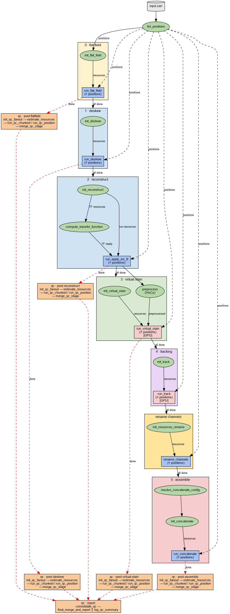

# Nextflow Pipelines

## Philosophy

Configs and launch scripts live **with the data**, not in the repo. Each experiment directory should contain:

```
experiment_dir/
  input.zarr
  configs/
    flat_field.yml
    deskew.yml
    reconstruct.yml
    ...
  run_pipeline.sh
  work/                  # nextflow work dir (gitignored, disposable)
```

The bash script pins all paths (input zarr, output dir, config dir, repo locations) and passes them to `nextflow run`. This keeps the pipeline definitions in the repo generic and reusable while the per-experiment choices are tracked alongside the data.

See the working example at:

```
/hpc/projects/intracellular_dashboard/refactor_biahub/phase2_dev/mantis_v2_dev/
  run_mantis_v2.sh
  configs/
    flat_field.yml
    deskew.yml
    reconstruct.yml
    predict.yml
    track.yml
    concatenate.yml
```

## Pipelines

### example-flatfield-deskew-reconstruct

Four-step pipeline: flat-field correction -> deskew -> reconstruct (compute transfer function + apply inverse TF) -> virtual stain (optional). Each step fans out per position within the plate zarr.


### mantis-v2-timelapse

Full mantis v2 pipeline: flat-field -> deskew -> reconstruct -> virtual stain + tracking (parallel) -> rename channels -> assembly (crop + concatenate). Designed for timelapse plate-level data.



## Environment setup

On HPC, load the required modules first:

```bash
module load nextflow
module load uv
```

Create the virtualenv (from the repo root):

```bash
cd /path/to/biahub
uv venv
uv sync
```

Nextflow processes use `uv run --project <path> biahub` to invoke the CLI, so the venv does not need to be activated at runtime. Pass `--biahub_project` to point to the repo root:

```bash
--biahub_project /path/to/biahub
```

Omit `--biahub_project` if `biahub` is already on `PATH` (e.g. in a container image).

Run `nextflow` from your experiment directory so that `.nextflow.log`, `.nextflow/`, and `work/` land there rather than in the repo.

## Usage

Write a bash launch script in your experiment directory. Example (`run_mantis_v2.sh`):

```bash
#!/usr/bin/env bash
set -euo pipefail

BIAHUB_PROJECT="/home/aliu/repos/biahub"
VISCY_PROJECT="/path/to/viscy-env"
QC_PROJECT="/path/to/imaging-qc-pipeline"
PIPELINE="${BIAHUB_PROJECT}/nextflow/mantis-v2-timelapse.nf"
NF_CONFIG="${BIAHUB_PROJECT}/nextflow/nextflow.config"
QC_CONFIGS="${BIAHUB_PROJECT}/settings/nextflow_templates/qc"

DEV_DIR="/path/to/experiment"
INPUT_ZARR="${DEV_DIR}/input.zarr"
OUTPUT_DIR="${DEV_DIR}"
CONFIGS="${DEV_DIR}/configs"
WORK_DIR="${DEV_DIR}/work"

nextflow run "${PIPELINE}" \
    -c "${NF_CONFIG}" \
    -profile slurm \
    --input_zarr         "${INPUT_ZARR}" \
    --output_dir         "${OUTPUT_DIR}" \
    --flat_field_config  "${CONFIGS}/flat_field.yml" \
    --deskew_config      "${CONFIGS}/deskew.yml" \
    --reconstruct_config "${CONFIGS}/reconstruct.yml" \
    --predict_config     "${CONFIGS}/predict.yml" \
    --track_config       "${CONFIGS}/track.yml" \
    --concatenate_config "${CONFIGS}/concatenate.yml" \
    --rename_suffix      "_recon" \
    --biahub_project     "${BIAHUB_PROJECT}" \
    --viscy_project      "${VISCY_PROJECT}" \
    --qc_config_dir      "${QC_CONFIGS}" \
    --qc_project         "${QC_PROJECT}" \
    --quarto_bin         "/home/aliu/opt/quarto-1.7.23/bin" \
    --work_dir           "${WORK_DIR}" \
    --num_threads        1 \
    -resume \
    "$@"
```

Use `-profile local` instead of `-profile slurm` for local execution.

## Parameters

| Parameter | Description |
|-----------|-------------|
| `--input_zarr` | Path to input plate-level OME-Zarr store |
| `--output_dir` | Parent directory for all intermediate and final zarrs |
| `--flat_field_config` | YAML config for `FlatFieldCorrectionSettings` |
| `--deskew_config` | YAML config for `DeskewSettings` |
| `--reconstruct_config` | YAML config for waveorder `ReconstructionSettings` |
| `--predict_config` | YAML config for VisCy virtual stain prediction (optional; enables virtual stain step) |
| `--track_config` | YAML config for tracking (optional) |
| `--concatenate_config` | YAML config for concatenation (optional) |
| `--rename_suffix` | Suffix for channel renaming (optional) |
| `--num_threads` | Intra-position parallelism for reconstruction (default: 1) |
| `--biahub_project` | Path to biahub repo root for `uv run` (optional; see [Environment setup](#environment-setup)) |
| `--viscy_project` | Path to VisCy repo root for `uv run` (optional) |
| `--max_positions` | Limit fan-out to first N positions (default: 0 = all positions) |
| `--work_dir` | Nextflow work directory for intermediate files (default: `work/` in current directory) |
| `--qc_config_dir` | Directory containing per-stage QC YAML configs (optional; enables QC stages) |
| `--qc_project` | Path to `imaging-qc-pipeline` repo root for `uv run` (optional; falls back to PyPI install) |
| `--qc_report_dir` | Directory for the final QC report (default: `<output_dir>/qc/report`) |
| `--qc_report_static` | Generate static PNG-only report instead of interactive Quarto/Plotly (default: `false`) |
| `--quarto_bin` | Path to directory containing the `quarto` binary (required for interactive reports on Slurm, where `~/.bashrc` is not sourced) |

## Output

The dataset name is derived from the input zarr basename (e.g. `experiment.zarr` -> `experiment`).

```
output_dir/
  0-flatfield/
    <dataset_name>.zarr
  1-deskew/
    <dataset_name>.zarr
  2-reconstruct/
    transfer_function_<dataset_name>.zarr
    <dataset_name>.zarr
```

## Profiles

| Profile | Executor | Notes |
|---------|----------|-------|
| `local` | Local | Pass `--biahub_project` to use `uv run` (see [Environment setup](#environment-setup)) |
| `slurm` | SLURM | Submits to `cpu` queue; deskew uses `gpu` queue with `--gres=gpu:1` |

## Nextflow reports

After a run completes, reports are written to `nextflow/output/`:
- `dag.html` — pipeline DAG
- `report.html` — execution report
- `trace.txt` — per-task trace
- `timeline.html` — timeline visualization

## Cleanup

After a run completes, remove Nextflow work directories, cache, and logs:

```bash
bash nextflow/cleanup.sh           # clean current directory
bash nextflow/cleanup.sh /path/to  # clean a specific directory
```

This does **not** remove your output zarrs — only Nextflow's internal files (`work/`, `.nextflow/`, logs, reports).

## CLI commands

The pipeline invokes these `biahub nf` subcommands:

```
biahub nf list-positions -i <plate.zarr>
biahub nf init-flat-field -i <input.zarr> -o <output.zarr> -c <config.yml>
biahub nf run-flat-field -i <input.zarr> -o <output.zarr> -p <position> -c <config.yml>
biahub nf init-deskew -i <input.zarr> -o <output.zarr> -c <config.yml>
biahub nf run-deskew -i <input.zarr> -o <output.zarr> -p <position> -c <config.yml>
biahub nf init-reconstruct -i <input.zarr> -o <output.zarr> -c <config.yml>
biahub nf compute-transfer-function -i <input.zarr> -t <tf.zarr> -c <config.yml>
biahub nf run-apply-inv-tf -i <input.zarr> -o <output.zarr> -t <tf.zarr> -p <position> -c <config.yml>
```

Each command is a single unit of work (no SLURM/submitit). Nextflow handles distribution and scheduling.
