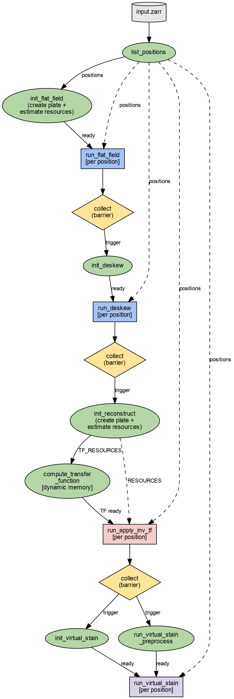

# Nextflow Pipelines

## example-flatfield-deskew-reconstruct

Three-step pipeline: flat-field correction → deskew → reconstruct (compute transfer function + apply inverse TF). Each step fans out per position within the plate zarr.



### Usage

```bash
nextflow run /path/to/biahub/nextflow/example-flatfield-deskew-reconstruct.nf \
    -profile local \
    --biahub_project /path/to/biahub \
    --input_zarr /path/to/input.zarr \
    --output_dir /path/to/output \
    --flat_field_config /path/to/flat_field.yml \
    --deskew_config /path/to/deskew.yml \
    --reconstruct_config /path/to/reconstruct.yml
```

Use `-profile slurm` instead of `-profile local` to submit jobs to SLURM.

Add `-resume` to restart from where a previous run left off.

### Environment setup

On HPC, load the required modules first:

```bash
module load nextflow
module load uv
```

Create the virtualenv (from the repo root):

```bash
cd /path/to/biahub
uv venv
uv sync
```

Nextflow processes use `uv run --project <path> biahub` to invoke the CLI, so the venv does not need to be activated at runtime. Pass `--biahub_project` to point to the repo root:

```bash
--biahub_project /path/to/biahub
```

Omit `--biahub_project` if `biahub` is already on `PATH` (e.g. in a container image).

Run `nextflow` from your project's pipeline directory so that `.nextflow.log`, `.nextflow/`, and `work/` land there rather than in the repo.

### Parameters

| Parameter | Description |
|-----------|-------------|
| `--input_zarr` | Path to input plate-level OME-Zarr store |
| `--output_dir` | Parent directory for all intermediate and final zarrs |
| `--flat_field_config` | YAML config for `FlatFieldCorrectionSettings` |
| `--deskew_config` | YAML config for `DeskewSettings` |
| `--reconstruct_config` | YAML config for waveorder `ReconstructionSettings` |
| `--num_processes` | Intra-position parallelism for reconstruction (default: 1) |
| `--biahub_project` | Path to biahub repo root for `uv run` (optional; see [Environment setup](#environment-setup)) |
| `--work_dir` | Nextflow work directory for intermediate files (default: `work/` in current directory) |

### Output

The dataset name is derived from the input zarr basename (e.g. `experiment.zarr` → `experiment`).

```
output_dir/
  0-flatfield/
    <dataset_name>.zarr
  1-deskew/
    <dataset_name>.zarr
  2-reconstruct/
    transfer_function_<dataset_name>.zarr
    <dataset_name>.zarr
```

### Profiles

| Profile | Executor | Notes |
|---------|----------|-------|
| `local` | Local | Pass `--biahub_project` to use `uv run` (see [Environment setup](#environment-setup)) |
| `slurm` | SLURM | Submits to `cpu` queue; deskew uses `gpu` queue with `--gres=gpu:1` |

### Nextflow reports

After a run completes, reports are written to `nextflow/output/`:
- `dag.html` — pipeline DAG
- `report.html` — execution report
- `trace.txt` — per-task trace
- `timeline.html` — timeline visualization

### Cleanup

After a run completes, remove Nextflow work directories, cache, and logs:

```bash
bash nextflow/cleanup.sh           # clean current directory
bash nextflow/cleanup.sh /path/to  # clean a specific directory
```

This does **not** remove your output zarrs — only Nextflow's internal files (`work/`, `.nextflow/`, logs, reports).

### CLI commands

The pipeline invokes these `biahub nf` subcommands:

```
biahub nf list-positions -i <plate.zarr>
biahub nf init-flat-field -i <input.zarr> -o <output.zarr> -c <config.yml>
biahub nf run-flat-field -i <input.zarr> -o <output.zarr> -p <position> -c <config.yml>
biahub nf init-deskew -i <input.zarr> -o <output.zarr> -c <config.yml>
biahub nf run-deskew -i <input.zarr> -o <output.zarr> -p <position> -c <config.yml>
biahub nf init-reconstruct -i <input.zarr> -o <output.zarr> -t <tf.zarr> -c <config.yml>
biahub nf run-apply-inv-tf -i <input.zarr> -o <output.zarr> -t <tf.zarr> -p <position> -c <config.yml>
```

Each command is a single unit of work (no SLURM/submitit). Nextflow handles distribution and scheduling.
