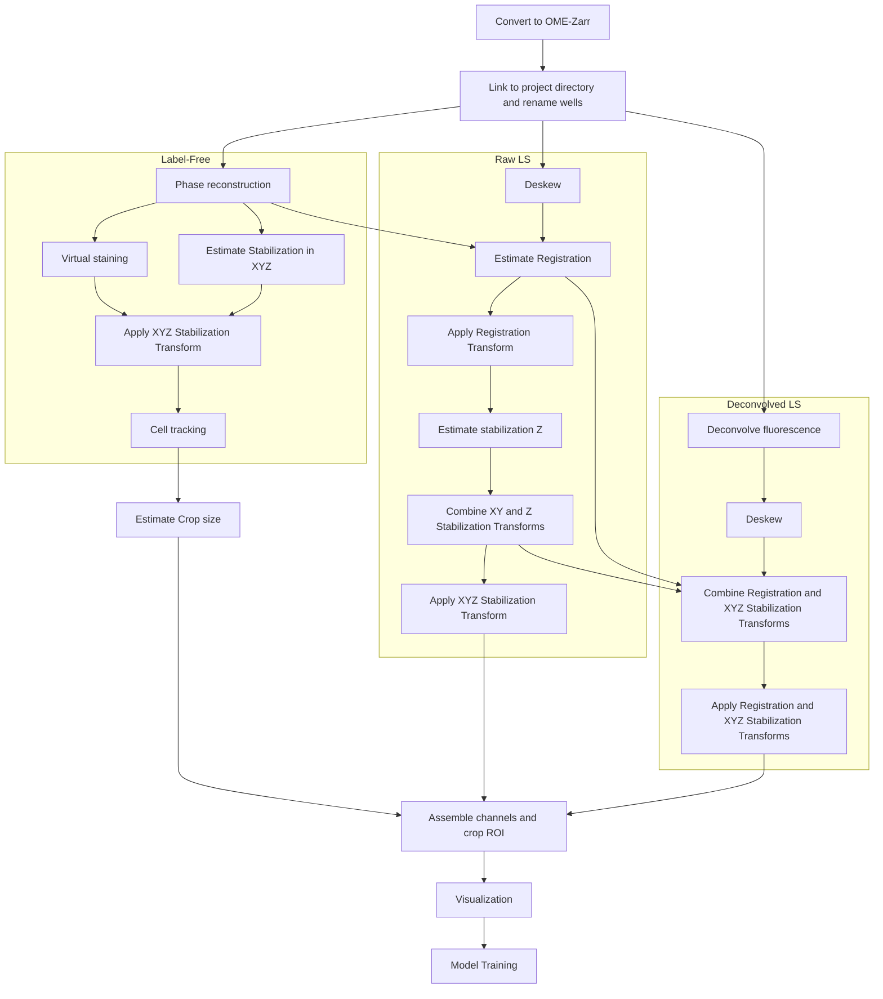

# Mantis Image Analysis Template
This repository provides a complete template for processing, analyzing, and visualizing 4D microscopy datasets using label-free and fluorescence imaging. It includes tools for Zarr conversion, reconstruction, preprocessing (including deskewing, deconvolution, and virtual staining), registration, and tracking. The pipeline is modular, reproducible, and optimized for high-throughput analysis at the CZ Biohub SF for dataset acquired with mantis microscope.

---

## Table of Contents

- [Data Reconstruction Workflow](#data-reconstruction-workflow)
- [Setup Environments](#setup-environments)
  - [1. VisCy](#1-viscy)
  - [2. Waveorder](#2-waveorder)
  - [3. Biahub](#3-biahub)
  - [Updating a Library](#updating-a-library)
- [Setup Dataset Analysis Repository](#setup-dataset-analysis-repository)
- [User-Free Steps of Dataset Reconstruction Pipeline](#user-free-steps-of-dataset-reconstruction-pipeline)
  - [Set Environment Variable](#set-environment-variable)
  - [Run Automatically](#run-automatically)
  - [Run Step by Step](#run-step-by-step)
    - [1. Convert to Zarr Format](#1-convert-to-zarr-format)
    - [2.1 Preprocessing of Label-Free Data](#21-preprocessing-of-label-free-data)
    - [2.2 Preprocessing of Raw Fluorescence Data](#22-preprocessing-of-raw-fluorescence-data)
    - [2.3 Preprocessing of Deconvolved Fluorescence Data](#23-preprocessing-of-deconvolved-fluorescence-data)
    - [3. Assemble Preprocessed Data](#3-assemble-preprocessed-data)
- [User-Dependent Steps of Dataset Reconstruction Pipeline](#user-dependent-steps-of-dataset-reconstruction-pipeline)
  - [1. Tracking](#1-tracking)
  - [2. Visualization](#2-visualization)

---

## Data Reconstruction Workflow



**Run commands on your terminal or command prompt**


## Setup Enviroments
Creating the conda enviroments for all steps of the pipeline
If working with in cluster bruno, remember to run `module load anaconda` before creating the enviroment

### 1. Viscy
```bash
conda create --name viscy python=3.11
cd $MYDATA
git clone https://github.com/mehta-lab/VisCy.git
cd VisCy
conda activate viscy
pip install .
conda deactivate
```
Alternativelly, you can install as editable ```pip install -e .```, which means that every change in the biahub folder will be consider when called. This is good to keep the enviroment up to date with main. 

### 2. Biahub
Install editable as you may need change branches.
```bash
conda create --name biahub python=3.11
cd $MYDATA
git clone https://github.com/czbiohub-sf/biahub.git
cd biahub
conda activate biahub
pip install -e .[dev]
conda deactivate
```

### How to update lib if need
For example editable install

```bash
conda activate biahub 
cd $MYDATA/biahub
git pull
conda deactivate
```
For non-editable install

```bash
conda activate mantis-pipeline
cd $MYDATA/biahub
git pull
pip install .
conda deactivate
```

## Setup Dataset Analysis Repository 
To get started, clone the repository from GitHub by following these steps:
Use the `cd` command to move to the directory where you want to clone the repository. For example:

   ```bash
   cd /path/to/your/directory
   ```

Execute the following command to clone the `mantis-analysis-template` repository:

   ```bash
   git clone https://github.com/czbiohub-sf/mantis-analysis-template.git {DATASET}
   ```
or 
```bash
git clone git@github.com:czbiohub-sf/mantis-analysis-template.git {DATASET}
```

This will create a local copy of the repository in your specified directory with your dataset name, for example, substitute DATASET for 2024_10_09_A549_TOMM20_ZIKV_DENV at the current directory.
  
  ```bash
   git clone https://github.com/czbiohub-sf/mantis-analysis-template.git 2024_10_09_A549_TOMM20_ZIKV_DENV
   ```

## User-Free Steps of Dataset Reconstruction Pipeline 
Move to dataset repo directory:
```bash
cd {DATASET}
```
### Set Environment Variable
In your terminal, set a `DATASET` environmental variable with the name of the dataset, for example:

```bash
export DATASET={DATASET}
```
For example:
```bash
export DATASET=2024_10_09_A549_TOMM20_ZIKV_DENV
```
### Run Automatically [DISABLED - TEMPORARY OFF]

Use any conda enviroment with python, for example:
```bash
conda activate biahub
```
```bash
cd {DATASET}
python run_pipeline.py
```
### Run Step by Step

#### 0. Convert to Zarr Format
 **a. Link Zarr Stores**
- The raw data is acquired in 4-hour chunks and converted into Zarr stores saved with the raw data.
- We’ll create a new Zarr store that contains data from all chunks. The data is symlinked, so there is no data duplication.
- Check the number of chunks in the original data and update the script as needed.
- Copy `well_map.csv` from the original path to the analysis path.

```bash
cd 0-convert
conda activate biahub
python link_datasets.py
# bash trim_timepoints.py  # If necessary, to remove extra time points
bash rename_wells.sh  # Rename wells based on `well_map.csv`
```

**b. Convert DRAQ5, FLUOR, and PSF Zarr stores**
```bash

bash convert_DRAQ5_PSF_FLUOR.sh
```
Modify the script if there is more than one of each acquisition.

#### 1.1 Preprocessing of Label-Free Data

**a. Reconstruct Phase3D**
```bash
cd 1-preprocess/label-free/0-reconstruct
bash reconstruct.sh
```

**b. Virtual Staining**

 - **Preprocessing Reconstructed Data**
```bash
cd 1-preprocess/label-free/1-virtual-stain/
sbatch preprocess.sh
```

 - **Predict the Virtual Staining**
```bash
cd 1-preprocess/label-free/1-virtual-stain
sbatch predict.sh
```
**c. Stabilize Phase Images for Drift**

- **Estimate Stabilization Parameters**
```bash
cd 1-preprocess/label-free/2-stabilize
bash estimate_stabilization.sh
```
- **Apply Stabilization**
```bash
cd 1-preprocess/label-free/2-stabilizec
bash stabilize_phase.sh
bash stabilize_virtual_stain.sh
``` 

**d. Tracking**

- **Check for Blank Frames**
```bash
conda activate biahub
cd 1-preprocess/label-free/3-track/
python check_blank_frames.py
```
Outputs a CSV file with the positions, the counts of blank frames, and the time index.

- If necessary fine-tune tracking parameters:
Use script in biahub https://github.com/czbiohub-sf/biahub/blob/main/scripts/debug_track.py for fine-tuning parameters.
 **Tips for tuning tracking:**
  - As tracking is 2D while data is 3D, check which z slices should be used for projection in the virtual staining data.
  - Check if the tracking is better with **max projection** or **mean projection**.
  - Use parameters from similar datasets as a starting point.
  - Improve segmentation parameters first, then fine-tune linking parameters.
  - Test if tracking is better with contour images (`mem_nuc_contor` or `inverted_edt` functions).

- **Update configuration**
Modify `tracking_settings.yml` with z_range, input path, and tracking parameters.

- **Run Tracking**
```bash
conda activate biahub
cd 1-preprocess/label-free/3-track/
bash 1-preprocess/label-free/3-track/track.sh
```

- **Crop tracks**
```bash
conda activate biahub
cd 1-preprocess/label-free/3-track/
python crop_track.py
```
#### 1.2 Preprocessing of Raw Fluorescence Data

**a. Deskew**
```bash
cd 1-preprocess/light-sheet/raw/0-deskew
bash deskew.sh
```

 **b. Regitration with Beads**

- **Estimate Registration with Beads**
Use https://github.com/czbiohub-sf/biahub/blob/main/scripts/beads_registration.py for checking the matches and fine-tune parameters.
```bash
cd 1-preprocess/light-sheet/raw/1-register
bash estimate_registration.sh
```
- **Apply Registration**
```bash
bash stabilize.sh
```
**b'. Manual Register Fluorescence Channels**
The registration protocol is being updated. Currently, we do manual registration for 3-5 time points and interpolate the registration parameters across time. Start by registering 3 time points - at the acquisition's beginning, middle, and end.

 - **Estimate registration**
```bash
cd 1-preprocess/light-sheet/raw/1-register/
bash estimate-registration.sh
```

- **Interpolate Registration Matrices**
```bash
conda activate biahub
cd 1-preprocess/light-sheet/raw/1-register/
python interpolate_reg_matrices.py
``` 
Please look over the registration across all time points and manually register additional time points if needed.
```bash
conda activate biahub
cd 1-preprocess/light-sheet/raw/2-register/
python register_timelapse.py
```
**c. Stabilize Fluorescence Data for Drift**
Z drifs are estimated independently from the label-free data, as the two paths can drift independently in z, but are the same in XY. So we estimate the transform for stabilization in Z from the registred LS and combine with the LF stabilization in XY transforms.

- **Estimate Z stabilization**
```bash
cd 1-preprocess/light-sheet/raw/2-stabilize/
bash estimate_stabilization.sh
```
- **Combine Tranforms**
```bash
conda activate biahub
python combine_stabilization_matrices.py
```
- **Apply stabilization**
```bash
bash stabilize.sh
```
- **Rename dataset channels**
```bash
conda activate biahub
cd 1-preprocess/light-sheet/raw/2-register/
python rename_channels.py
```


#### 1.3 Preprocessing of Deconvolved Fluorescence Data

**a. Deconvolve**
- **Estimate PSF**
We acquire data on sub-resolution fluorescent beads, which we use to estimate the point spread function of the microscope.
```bash
cd 1-preprocess/light-sheet/deconvolved/0-decon/
bash estimate_psf.sh
```

- **Deconvolve**
```bash
cd 1-preprocess/light-sheet/deconvolved/0-decon/
bash deconvolve.sh
```

**b. Deskew**
```bash
cd 1-preprocess/light-sheet/deconvolved/1-deskew/
bash deskew.sh
```
**c. Stabilize and Register**

- Combine Tranforms
Combine registration and XYZ Transform to apply same transforms used for Raw Fluorescent.
```bash
conda activate biahub
python combine_stabilization_matrices.py
```
- **Apply stabilization**
```bash
bash stabilize.sh
```

#### 2. Assemble Preprocess Data into a Single Zarr Store
Crop and assemble all channels into a single Zarr store.
Update `concatenate.yml` for the dataset.
- **Estimate Crop**
```bash
cd 2-assemble
bash estimate_crop.sh
```
- **Assemble**
```bash
cd 2-assemble
bash assemble.sh
```

#### 3. Visualization
You can run both visualization scripts in a conda environment with biahub: https://github.com/czbiohub-sf/biahub and with ultrack: https://github.com/royerlab/ultrack

**a. Vizualize Fluorecent and Phase Channels**
Running the command line
```bash
conda activate biahub
cd 3-visualizationpython visualization fluorecent.py dataset_dirpath fov
```

For example:

```bash
conda activate biahub
cd 3-visualization
python visualization fluorecent.py /hpc/projects/intracellular_dashboard/organelle_dynamics/2024_10_31_A549_SEC61_ZIKV_DENV B/1/000000
```

It will open a napari window with GFP, mCherry, phase . Here is a video of how the layers will appear, and after its open the user can change any config or order of layers. This script is for visualization purposes, it does not save any output. I will also use the napari pluging to generate videos for all datasets.


**b. Visualize Tracking in 2D with Phase and Virtual Stanining Channels**
Running the command line

```bash
conda activate biahub
cd 3-visualization
python visualization_tracks.py dataset_dirpath fov zslices
```

For example:

```bash
conda activate biahub
cd 3-visualization
python visualization_tracks.py /hpc/projects/intracellular_dashboard/organelle_dynamics/2024_10_31_A549_SEC61_ZIKV_DENV B/1/000000 28,38
```

It will open a napari window with phase in the z focal plane of t=0, nuc and mem virtual staning max projected from the z stack of the input slices (recommended to use the ones used for tracking) and the tracks as contour and the tracking lineage. Here is a video of how the layers will appear, and after its open the user can change any config or order of layers. This script is for visualization purposes, it does not save any output. I will also use the napari pluging to generate videos for all datasets.

**c. Generate Videos for FOVs and Wells**

This section documents three Python scripts that automate the creation of .mp4 videos using either 5D OME-Zarr datasets or existing .mp4 inputs. All scripts use YAML configuration files for flexible settings. 

- **FOV-Level Video Generation**

`napari_zarr_to_mp4.py`  script generates .mp4 videos from individual OME-Zarr FOVs . It supports:

- Multiple imaging channels
- Channel-specific contrast limits and colormaps
- Optional Z-slice or maximum projection
- Adjustable frame rate (fps)

*Z-Stack Handling*

- If z_index is specified, the selected slice is used for every frame.
- If z_index is omitted, the script performs a maximum intensity projection over Z per timepoint.


*Config file example:* `3-visualization/napari_zarr_to_mp4.yaml`

```yaml
input_path: "/path/to/zarrs/*/*/*"
output_path: "/path/to/output"
fps: 3
z_index: 66

channels:
  - name: "Phase3D"
    contrast_limits: [100, 500]
    colormap: "gray"
  - name: "GFP EX488 EM525-45"
    contrast_limits: [100, 800]
    colormap: "green"
  - name: "mCherry EX561 EM600-37"
    contrast_limits: [150, 900]
    colormap: "magenta"

```

*Usage*
```bash
conda activate biahub
cd 3-visualization
python napari_zarr_to_mp4.py
```

This script will read the Zarr data and generate one video per FOV in the output directory specified.

- **Well-Level Video Grid Assembly**

 `grid_per_well.py`  script creates grid-layout videos by grouping .mp4 videos of FOVs that belong to the same well. It automatically parses well identifiers from filenames (e.g., B_1_000000.mp4) and creates one output video per well.

*Config file example:* `3-visualization/grid_per_well.yaml`

```yaml
mov_fov_path: /path/to/videos
output_path: /path/to/output
grid: [2, 2]
time_sampling_min: 5
rotation: 90  # good for deskewed ls
max_frames: null       # or 300
frame_step: 5          # skip every 4, keep every 5th
legend: null
legend_font_size: 20
timestamp_font_size: 24
add_legend: true


```

The script assumes that FOV filenames are formatted with well identifiers (e.g. `B_1_000000.mp4`) and automatically groups by well.

All videos must already exist in the mov_fov_path.
*Usage*
```bash
conda activate biahub
cd 3-visualization
python grid_per_well.py
```

It will create grid videos like `B1.mp4`, `C2.mp4`, etc. inside the output_path.


- **Flexible Grid Assembly**

`grid_mov.py` script combines an arbitrary list of .mp4 videos into a single grid video. It’s ideal for combining different channels, views, or processing outputs of a single FOV. You can also batch-generate videos for a list of FOVs by templating paths and legends.

*Key Features*

- Per-video settings: crop, rotation, legend, timestamp, etc.
- Batch mode using `fov_list` for multi-FOV processing
- Ensures output filenames are unique to avoid overwrites

*Config example:* 3-visualization/grid_mov.yaml
```yaml
fov_list:
  - 0/1/000000
  - 0/1/001000
  - 0/1/002000
  - 0/2/000000
  - 0/2/001000
  - 0/2/002000
  - 0/2/003000
  - 0/8/000000

output_dir: /path/to/output/
output_filename: BF_nuc_mem_0_2_002000.mp4
grid: [1, 3]

movs:
  - mov_path: BF/fov/0_2_002000.mp4
    crop_box: [176, 1072, 970, 2166]
    legend: "BF - 0/2/002000"
    legend_font_size: 20
    timestamp_font_size: 20
    rotation: 0
    frame_step: 12
    frame_time_sampling_min: 5

  - mov_path: nuclei_projection/fov/0_2_002000.mp4
    crop_box: [0, 784, 240, 881]
    legend: "Nuclei max projection - 0/2/002000"
    legend_font_size: 20
    timestamp_font_size: 20
    rotation: -90
    frame_step: 12
    frame_time_sampling_min: 5

  - mov_path: membrane_projection/fov/0_2_002000.mp4
    crop_box: [0, 1248, 976, 2168]
    legend: "Membrane max projection - 0/2/002000"
    legend_font_size: 20
    timestamp_font_size: 20
    rotation: -90
    frame_step: 12
    frame_time_sampling_min: 5
```
*Usage*

```bash
conda activate biahub
cd 3-visualization
python grid_mov.py
```

If `fov_list` is present, it will generate one video per FOV by replacing the placeholders in output_filename and mov_path.

- **Summary Table**

| Script Name              | Purpose                                                    | Input            | Output Type            |
|--------------------------|-------------------------------------------------------------|------------------|-------------------------|
| `napari_zarr_to_mp4.py`  | Generate videos from OME-Zarr FOVs                         | OME-Zarr         | `.mp4` per FOV          |
| `grid_per_well.py`       | Combine FOV `.mp4`s into well-level grids                  | FOV `.mp4` files | `.mp4` per well         |
| `grid_mov.py`            | Grid arbitrary video lists (e.g., all channels of one FOV) | `.mp4` list      | `.mp4` per FOV (batched) |
